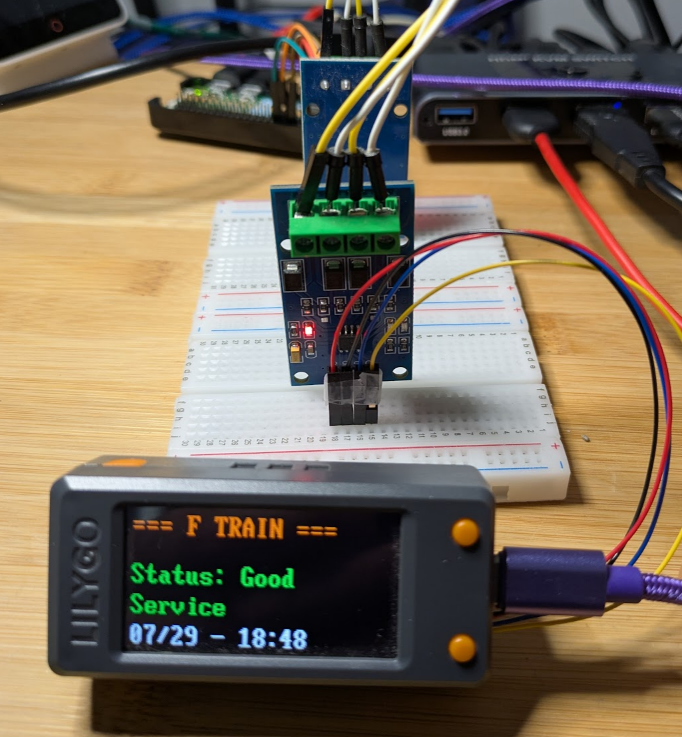

# 🚇 MicroPython Transit Monitor

> A modular, memory-optimized semi-real-time NYC Subway monitor.

[](https://www.espressif.com/en/products/socs/esp32)
[](https://micropython.org/)
[](LICENSE)
[](CONTRIBUTING.md)

[](T-Display)

Originally designed for NYC MTA subway lines but adaptable to any transit API.

## 📸 Demo

The system cycles through configured transit lines (F and R trains by default), displaying:
- ✅ Real-time service status
- 🚨 Service alerts and planned work  
- ⏰ Delays and service changes
- 🔄 Automatic line switching with manual override (If using T-Display-S3)

## ✨ Features

| Feature | Description |
|---------|-------------|
| 🚊 **Real-time Transit Data** | Fetches live subway status from transit API |
| 📺 **TFT Display** | Scrolling text display with line-specific colors |
| 📱 **IP Connectivity** | PPP connection for internet access bypassing WPA Enterprise limitations|
| 💾 **Memory Optimized** | Lazy loading and garbage collection for stable operation |
| 🎛 **Hardware Controls** | Button interrupts for line switching |
| ⚡ **Caching** | Smart caching reduces API calls and improves responsiveness |
| 🏗 **Modular Design** | Clean separation of concerns across modules |

## 🛠 Hardware Requirements

### Components
- **ESP32** development board
- **TFT Display** (configured for s3lcd library)
- **UART** acts as modem (uses PPP support)
- **Push Button** for line switching

### Pin Configuration
```python
PINS = {
    'led': 2,           # Status LED
    'button1': 0        # Line switch button
}

PPP_CONFIG = {
    'uart_id': 1,       # UART for cellular modem
    'tx_pin': 44,       # TX pin
    'rx_pin': 43,       # RX pin
    'baudrate': 9600
}
```

## 🚀 Quick Start

### Step 1: Flash MicroPython
Flash MicroPython firmware to your ESP32 device.
https://github.com/russhughes/st7789s3_mpy/blob/main/firmware/firmware.bin

### Step 2: Install Libraries
```bash
# Install s3lcd for TFT display support
# (Use Russ's FW above)
```

### Step 3: Upload Code
Upload all Python files to your ESP32:

```bash
# Using ampy, mpremote, or your preferred tool
ampy -p /dev/ttyUSB0 put config.py
ampy -p /dev/ttyUSB0 put display_manager.py
ampy -p /dev/ttyUSB0 put ppp_manager.py
ampy -p /dev/ttyUSB0 put transit_client.py
ampy -p /dev/ttyUSB0 put hardware_manager.py
ampy -p /dev/ttyUSB0 put utils.py
ampy -p /dev/ttyUSB0 put smain.py
ampy -p /dev/ttyUSB0 put main.py
```

### Step 4: Configure
Edit `config.py` to match your setup:

```python
# Transit API endpoint (Here we use a Pi Zero)
SERVICE_URL = "http://your-transit-api:5000"

# Hardware pins
PINS = {
    'led': 2,
    'button1': 0
}

# Transit lines to monitor
TRANSIT_LINES = ['F', 'R']  # Customize for your needs
```

### Step 5: Run
```python
# On ESP32 REPL
import smain
# Application will start automatically
```

## 📁 Project Structure

```
├── 📄 main.py              # Default Main file 
├── 📄 smain.py             # Main application orchestrator
├── ⚙ config.py             # Configuration constants
├── 📺 display_manager.py   # TFT display operations
├── 📡 ppp_manager.py       # Cellular connectivity
├── 🚊 transit_client.py    # API client with caching
├── 🎛 hardware_manager.py  # Button/LED control
├── 🔧 utils.py             # Utility functions
└── 📋 README.md            # This file
```

## ⚙ Configuration

<details>
<summary><b>🚊 Transit Lines Configuration</b></summary>

Add or modify monitored lines in `config.py`:
```python
TRANSIT_LINES = ['F', 'R', '4', '5', '6']  # Add any lines

# Line colors (MTA official colors)
SUBWAY_LINE_COLORS = {
    'F': 'ORANGE',
    'R': 'YELLOW',  
    '4': 'GREEN',
    # Add custom mappings
}
```
</details>

<details>
<summary><b>⏱ Timing Settings</b></summary>

```python
TIMING = {
    'line_display_duration': 10,  # Seconds per line
    'startup_delay': 2,
    'interrupt_debounce_ms': 500
}
```
</details>

<details>
<summary><b>💾 Memory Management</b></summary>

```python
MEMORY_CONFIG = {
    'low_memory_threshold': 10000,
    'gc_interval': 10,           # Garbage collect every N cycles
    'max_text_length': 200       # Truncate long messages
}
```
</details>

## 🎮 Usage

### Normal Operation
- 🔄 System automatically cycles through configured transit lines
- ⏱ Each line displays for 10 seconds (configurable)
- 📊 Real-time status updates with color-coded information

### Manual Control
- **🔘 Button Press**: Switch to next line immediately
- **🔧 Automatic Recovery**: PPP reconnection, service health monitoring
- **💾 Memory Management**: Automatic garbage collection and cache management

### Status Indicators

| Color | Meaning |
|-------|---------|
| 🟢 **Green** | Good service, successful operations |
| 🟡 **Yellow** | Delays, warnings, cached data |
| 🔴 **Red** | Service issues, errors |
| 🔵 **Blue** | Headers, system status |
| 🟠 **Orange** | F train (line-specific colors) |

## 🧪 Testing

The system includes comprehensive testing functions:

```python
# Test individual components
import smain

smain.test_display()      # Test TFT display
smain.test_ppp()         # Test cellular connectivity  
smain.test_memory()      # Check memory usage
smain.test_full_system() # Test all modules
```

### Module Testing
```python
# Test transit API
from transit_client import quick_line_test
quick_line_test('F')

# Test hardware
from hardware_manager import quick_led_test
quick_led_test()
```

## 🌐 API Integration

The system expects a REST API with these endpoints:

| Endpoint | Description |
|----------|-------------|
| `GET /health` | Service health check |
| `GET /transit/line/{line_id}` | Line-specific data |
| `GET /transit/status` | General status |
| `GET /transit/alerts` | System alerts |

### Expected API Response Format
```json
{
  "train": "F TRAIN",
  "status": "Good Service",
  "last_updated": "2024-01-15T14:30:25",
  "active_trips": 45,
  "active_alerts": 0,
  "delays": [],
  "service_changes": [],
  "planned_work": []
}
```

## ⚡ Performance Features

### 💾 Memory Optimization
- **Lazy Loading**: Modules loaded only when needed
- **Garbage Collection**: Automatic memory management
- **Cache Limits**: Bounded cache size with LRU eviction
- **Text Truncation**: Long messages automatically shortened

### 🌐 Network Efficiency
- **Smart Caching**: 30-second cache timeout reduces API calls
- **Connection Reuse**: Persistent PPP connection with auto-reconnect
- **Error Recovery**: Graceful degradation with stale data fallback

### 📺 Display Optimization
- **Smooth Scrolling**: Pixel-by-pixel scrolling animation
- **Header Protection**: Headers remain visible during content updates
- **Word Wrapping**: Automatic text wrapping for long messages

## 🛡 Error Handling

| Error Type | Handling Strategy |
|------------|------------------|
| 🌐 **Network Failures** | Automatic PPP reconnection with exponential backoff |
| 🚊 **API Errors** | Graceful fallback to cached data |
| 🎛 **Hardware Issues** | Soft failures with console fallback |
| 💾 **Memory Exhaustion** | Automatic garbage collection and cache cleanup |

## 🔍 Debugging

### Console Output
All modules provide console logging even when display is unavailable:
```python
# Enable verbose logging
from utils import print_memory_status
print_memory_status()

# Get system information
info = utils.get_system_info()
print(info)
```

### Status Monitoring
```python
# Check component status
if ppp:
    print(ppp.get_status(detailed=True))
    
if transit:
    print(transit.get_client_stats())
```

## 🎨 Customization Examples

<details>
<summary><b>Adding New Transit Lines</b></summary>

```python
# In config.py
TRANSIT_LINES = ['F', 'R', '4', '5', '6', 'L']

SUBWAY_LINE_COLORS = {
    'L': 'WHITE',  # Add new line color
    # ... existing colors
}
```
</details>

<details>
<summary><b>Custom Display Messages</b></summary>

```python
# Create custom display callback
def custom_display(text, color):
    # Add timestamp or custom formatting
    timestamp = time.time()
    formatted = f"[{timestamp}] {text}"
    display.show_text(formatted, color)
```
</details>

<details>
<summary><b>Extended API Integration</b></summary>

```python
# Add weather or other data sources
def fetch_weather_data():
    # Your weather API integration
    return weather_data

# Integrate into main loop
def enhanced_display():
    show_line_status(current_line)
    if cycle_count % 20 == 0:  # Every 20 cycles
        show_weather_data()
```
</details>

## 🤝 Contributing

We welcome contributions! Please see our [Contributing Guidelines](CONTRIBUTING.md) for details.

1. 🍴 Fork the repository
2. 🌿 Create a feature branch (`git checkout -b feature/amazing-feature`)
3. 💾 Commit your changes (`git commit -m 'Add amazing feature'`)
4. 📤 Push to the branch (`git push origin feature/amazing-feature`)
5. 🔄 Open a Pull Request

## 📄 License

This project is licensed under the MIT License - see the [LICENSE](LICENSE) file for details.

## 🙏 Acknowledgments

- 🐍 [MicroPython community](https://micropython.org/) for the excellent embedded Python implementation
- 🚇 [NYC MTA](https://www.mta.info/) for providing transit data APIs
- 🔧 ESP32 community for hardware support and libraries
- 🔧 Russ Hughes - for the T-Display firmware -  https://github.com/russhughes/st7789s3_mpy/blob/main/firmware/firmware.bin
- The ideas, configs, connections, testing, etc are mine. But AI and I vibe coded this repo and the README!


## 📞 Support

Having issues? We're here to help!

1. 📋 Check the console output for error messages
2. ⚙ Verify your `config.py` settings match your hardware
3. 🧪 Test individual modules using the provided test functions
4. 🐛 [Open an issue](../../issues) with detailed error logs and configuration

---

<div align="center">

**Built with ❤ for real-time transit information**

[⭐ Star this repo](../../stargazers) • [🐛 Report Bug](../../issues) • [💡 Request Feature](../../issues)

</div>
